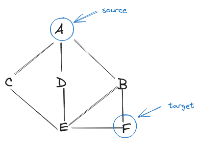
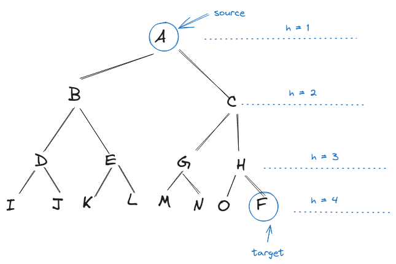

Suppose we have an undirected graph like below:



We want to find the shortest path between A and F. Because the graph is unweighted, this seems like a good task for BFS.

There are two ways to implement BFS. The first approach stores each candidate path as an array in a queue. When the last node in a path is the destination node, return the path immediately.

The second approach simply stores the last visited element in a queue. However, it maintains a mapping of each node to its parent. When the top element of the queue happens to be the destination, backtrack to trace the parent until we come across the source node.

## BFS using array to store paths in queue

```js
function shortestPath(graph, source, destination) {
  const adjList = {};
  for (const [node1, node2] of graph) {
    if (!adjList[node1]) {
      adjList[node1] = [];
    }
    adjList[node1].push(node2);
    if (!adjList[node2]) {
      adjList[node2] = [];
    }
    adjList[node2].push(node1);
  }
  const queue = [[source]];
  const visited = new Set();
  visited.add(source);
  while (queue.length > 0) {
    const path = queue.shift();
    const node = path[path.length - 1];
    if (node === destination) {
      return path;
    }
    for (const neighbor of adjList[node]) {
      if (!visited.has(neighbor)) {
        visited.add(neighbor);
        queue.push([...path, neighbor]);
      }
    }
  }
  return [];
}
const graph = [
  ["A", "C"],
  ["A", "D"],
  ["A", "B"],
  ["C", "E"],
  ["D", "E"],
  ["B", "E"],
  ["B", "F"],
  ["E", "F"],
];
```

This a a simple, straightforward solution but you can see that the running time is dominated by the deep copy operation:

```js
queue.push([...path, neighbor]);
```

To safely store explored paths, in a queue, we need to construct a new path by copying the previous path and add neighbor node.

In the best case where the path from source to target is a straight line, the copy operation will take

O(1) + O(2) + O(3) + ... + O(n) = n \* (n + 1) / 2

So the time complexity will be quadratic, `O(n^2)`.

What about the worst case? The worst c case is when the graph keeps branching out between the source and target node.



The copy operation will spend:

1 _ 2^0 + 2 _ 2^1 + 3 _ 2^2 + 4 _ 2^3 + ...

Below is my proof:


The sum is (h - 1)2^h + 1, so the time complexity wll be `O(h * 2^h)`, where h is the height from the source to the target node.

If you want to know why the summation of all exponents of 2 from 1 to n is 2^(n + 1) - 1, take a look at my [related notes](/posts/maximum-number-of-paths-between-source-and-target-vertex-on-directed-acyclic-graph), which contains a proof for it.

## BFS mapping each node to its parent

The above solution would be impractical when there are a lot of branches between the source and target node.

Instead of storing an array of path in the queue, we only store the recently visited node. But how do we construct a path when we hit the destination?

We use a hash map to map each node to its parent node. When we come across the target node, this is for sure the shortest path we can find thanks to the feature of BFS. We'll use the hash map to trace back the parent until we run into the source node.

```js
function backtrack(parent, start, end) {
  const path = [];
  let lastNodeVisited = end;
  while (lastNodeVisited !== start) {
    path.push(lastNodeVisited);
    lastNodeVisited = parent[lastNodeVisited];
  }
  path.push(start);
  return path.reverse();
}
function shortestPath(graph, source, destination) {
  const adjList = {};
  for (const [node1, node2] of graph) {
    if (!adjList[node1]) {
      adjList[node1] = [];
    }
    adjList[node1].push(node2);
    if (!adjList[node2]) {
      adjList[node2] = [];
    }
    adjList[node2].push(node1);
  }
  const queue = [source];
  const parents = {};
  while (queue.length > 0) {
    const node = queue.shift();
    if (node === destination) {
      return backtrack(parents, source, destination);
    }
    for (const neighbor of adjList[node]) {
      if (!parents[neighbor]) {
        parents[neighbor] = node;
        queue.push(neighbor);
      }
    }
  }
  return [];
}
```

For this approach, in the worst case, we will have to visit every node and every edge, which takes `O(V + E)`, where V is the number of vertices and E is the number of edges. The backtrack takes `O(V)` assuming that we have to traverse all the intermediate node to go from source to target node. This part takes `O(V)`.

So the general time complexity is `O(V + E)`, which is still gentler than the first approach.
