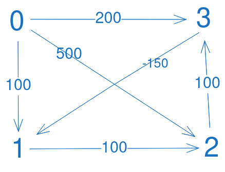

The dynamic programming technique is often used to solve the shortest distance between any pair of vertices. However, if we fix the start node, we can turn it into a solution for solving single source shortest path.

Let's say we have a directed acyclic graph (DAG) as below.



This graph has negative-weight edges, so we can't use Dijkstra's algorithm here. Let's see if dynamic programming can solve it.

In a DAG with N vertices, there are at most N - 1 edges between any two vertices. Otherwise, we will have a cycle, and the graph will stop being acyclic. Therefore, the shortest path between any two vertices can't have more than N - 1 edges.

This graph has 4 vertices. This means there are at most 3 edges in the shortest path between two points.

Suppose the start node is 0. We can break down the problem into three subproblems finding the shortest distance between 0 and 1, 0 and 2, 0 and 3.

To illustrate, we can use a table to store the shortest distance betwen those two pairs using 0, 1, 2, or 3 edges.


At first, we don’t know anything about the graph, so the shortest distance will be initialized to positive infinity.

## Using at most 0 edge

From 0, we can always go back to 0 using 0 edge. So the distance must be 0.

For node 1, 2 and 3, it's impossible to reach 0 using 0 edge, so the corresponding values remain positive infinity.


## Using at most 1 edge

For _node 0_, the shortest distance between 0 and 0 is still 0.

But for _node 1_, there are two edges pointing towards it: from 3 and from 0.

The edge from node 3 to node 1 counts as 1 edge. But we can only use **1 edge** to go from 0 to 1. So we have to look at the shortest distance from 0 to 3 using **0 edge**. If we subtract -150 (distance from 3 to 1) from positive infinity (shortest distance from 0 to 3), we still get positive infinity.

Instead, start from 0. Based on last visit, distance from 0 is 0. Now, we add another edge: [0, 1], whose distance is 100. Update distance from 0 and 1 using 1 edge to 100.


For _node 2_, there are two incoming edges from 1 and from 0. Let’s calculate the edge from 1.

Looking at the table, the edge from 1 can have a distance of positive infinity or 100. Which should we choose? Choose the former! If we take the path of 100, the path from 0 to 1 already requires **one edge**. Adding up another edge from 1 to 2, we'll need to use up two edges, which contradicts the requirement of using **at most one edge**. So we need to choose positive infinity. The distance from 0 to 2 going through 1 will still be positive infinity.

Let’s consider reaching node 2 from node 0. The edge between node 0 and node 2 has a distance of 500, which is smaller than infinity, so update to 500.


For _node 3_, it can come from 0 or 2. If we go through 2, [2, 3] is considered one edge, but we can only use at most **one edge** from 0 to 3. So we will have to use **0 edge** to go from node 0 to node 2.

Looking up the table, going from 0 to 2 using **0 edge** takes positive infinity. Adding 100, the distance between 2 and 3 will not change it, so we keep positive infinity.

What if we comes from 0? We get:

shortest distance from 0 to 0 using 0 edge + distance from 0 to 3 = 0 + 200 = 200. This is smaller than positive infinity, so we update.


By now, can you see the pattern? Whenever we want to get the shortest distance between the source node and a particular node using at most `k` edges:

- Check for incoming edges to this node. If there is none, the search ends here. There is no way to get from the source node to the current node and the distance will always be positive inifinity.
- For each incoming edge, look above the current row to see the shortest distance from source node to the intermediate node using at most `k - 1` edges. To this number, add the distance between intermediate node and the current node, which happens to be the weight of the incoming edge.

It may sound verbose, but it's very easy to see when presented in a table.


Here is the full functional code

```js
const graph = [
  [0, 3, 200],
  [2, 3, 100],
  [1, 2, 100],
  [0, 1, 100],
  [0, 2, 500],
  [3, 1, -150],
];

function shortestPathUsingDp(graph, V, sourceNode) {
  const adjList = new Array(V);
  for (let i = 0; i < V; i++) {
    adjList[i] = [];
  }
  for (const [start, end, weight] of graph) {
    adjList[end].push([start, weight]);
  }
  console.log(adjList);
  const dist = Array.from(Array(V), () =>
    new Array(V).fill(Number.MAX_SAFE_INTEGER)
  );
  for (let edges = 0; edges < V; edges++) {
    dist[edges][sourceNode] = 0;
  }
  for (let edges = 1; edges < V; edges++) {
    const currentPairs = dist[edges];
    for (let endNode = 0; endNode < V; endNode++) {
      // A node can always reach itself regardless of edges, so we skip it
      if (endNode === sourceNode) {
        continue;
      } else {
        const incomingEdges = adjList[endNode];
        for (const [intermediateNode, intermediateDistance] of incomingEdges) {
          if (
            currentPairs[endNode] >
            dist[edges - 1][intermediateNode] + intermediateDistance
          ) {
            currentPairs[endNode] =
              dist[edges - 1][intermediateNode] + intermediateDistance;
          }
        }
      }
    }
  }
  for (let node = 0; node < V; node++) {
    if (node === sourceNode) {
      continue;
    }
    for (let edges = 0; edges < V; edges++) {
      const distance =
        dist[edges][node] === Number.MAX_SAFE_INTEGER
          ? "positive infinity"
          : dist[edges][node];
    }
  }
}

shortestPathUsingDp(graph, 4, 0);
```

Your final table should look like this:


