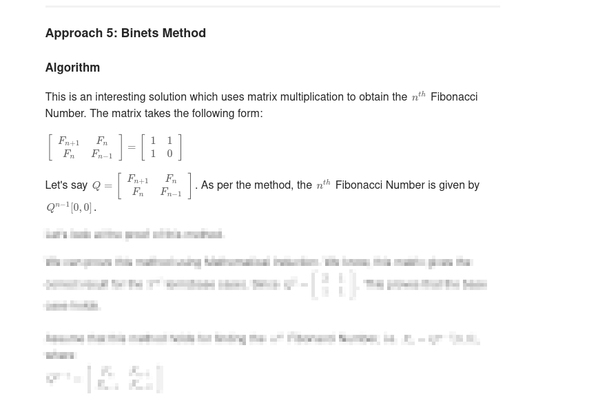
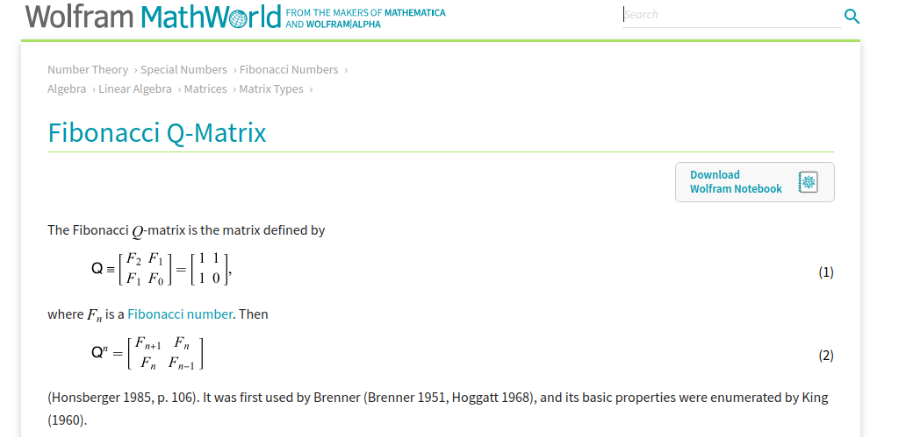
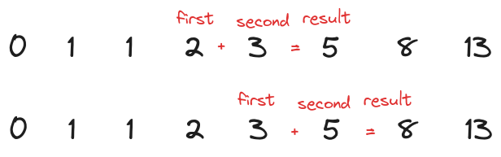
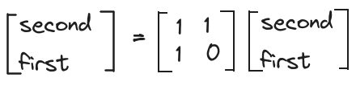
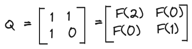

You're probably familiar with the Fibonacci sequence. After all, it is commonly used to illustrate the concept of recursive functions to new programmers.

There are two well-known ways to calculate the n-th Fibonacci number: recursion and iteration. However, thanks to Leetcode, I've learned of another solution: use matrix multiplication.

However, this solution starts with the concept of the Fibonacci Q-Matrix: `[[1, 1], [1, 0]]`. They didn't explain any further what this matrix means, or how does one come up with this matrix!



The entry for Fibonacci Q-Matrix on Wolfram Mathworld is no better.



Do we have to accept this definition as it is, without any explanation? The problem is that if I don't at least understand this matrix conceptually, it will soon be erased from my short-term memory.

Fret not, I've found an easy way. As you already know, to calculate a Fibonacci number at at position, we need to know **two** numbers before it. Let's call this `first` and `second`. Some sources use the term `previous` and `current`, but I found that even more confusing.

Once this is done, how do we get the next value? We advance the `first` and `second` values to the right.

`first` is discarded, `second` becomes `first`, and what was the result becomes `second`.



The new assignments will be written like this in cseudocodes:

```text
second(n + 1) = result = second(n) + first(n)
first(n + 1) = second(n)
```

It is even more obvious when we write it in terms of linear equations:

```text
second(n + 1) = 1 * second(n) + 1 * first(n)
first(n + 1) = 1 * second(n) + 0 * first(n)
```

And the linear equations above can be rewritten with matrix:



The matrix here is called the Fibonacci Q-Matrix. So what is the significance of this matrix?

> Fibonacci Q-Matrix brings the number from n-th position the n+1 -th position.

Recall that a Fibonacci sequence is 0, 1, 1, 2, 3 etc. So F(0) = 0, F(1) = 1, F(2) = 1. We can replace the numbers in the matrix with the Fibonacci numbers.


