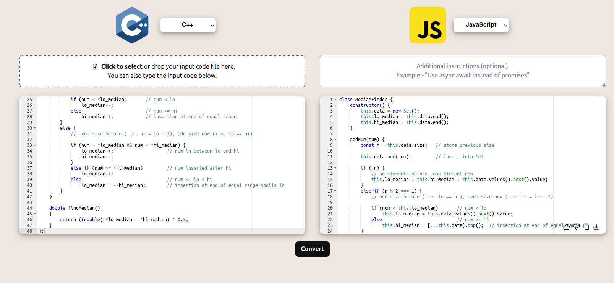
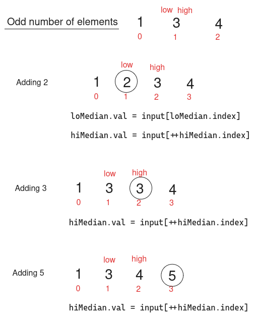
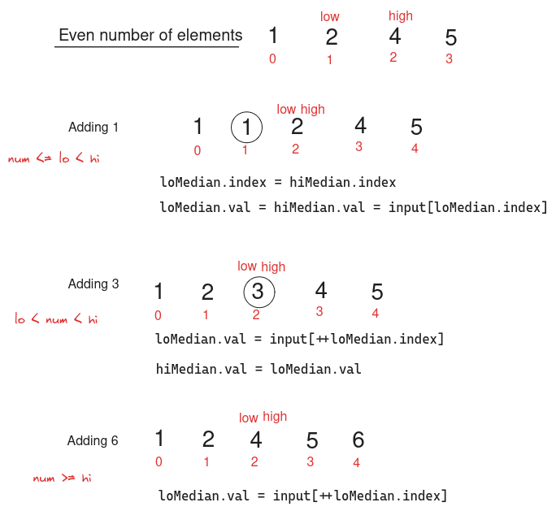

There is an interesting algorithm problem on Leetcode: [Find median from a data stream](https://leetcode.com/problems/find-median-from-data-stream). It can be solved using several methods, ranging from naive simple sorting, to insertion sort, to not sorting at all. Yes, you don't have to sort the entire input in order to access the median values! The problem is available for non-premium users, so you should check it out.

However, that is not the whole point of this article. I've discovered that there is another solution that uses **multiset and two pointers**. The solution was written in C++:

```c
class MedianFinder {
  multiset<int> data;
  multiset<int>::iterator lo_median, hi_median;

public:
  MedianFinder()
    : lo_median(data.end())
    , hi_median(data.end())
    {
    }

  void addNum(int num)
  {
    const size_t n = data.size();   // store previous size

    data.insert(num);               // insert into multiset

    if (!n) {
      // no elements before, one element now
      lo_median = hi_median = data.begin();
    }
    else if (n & 1) {
      // odd size before (i.e. lo == hi), even size now (i.e. hi = lo + 1)

      if (num < *lo_median)       // num < lo
        lo_median--;
      else                        // num >= hi
        hi_median++;            // insertion at end of equal range
      }
      else {
        // even size before (i.e. hi = lo + 1), odd size now (i.e. lo == hi)

        if (num > *lo_median && num < *hi_median) {
          lo_median++;                    // num in between lo and hi
          hi_median--;
        }
        else if (num >= *hi_median)         // num inserted after hi
          lo_median++;
        else                                // num <= lo < hi
          lo_median = --hi_median;        // insertion at end of equal range spoils lo
      }
    }

  double findMedian()
  {
    return ((double) *lo_median + *hi_median) * 0.5;
  }
};
```

Wait, what is multiset and why haven't I heard about this data structure? That is because multiset is not available in Javascript. There are several Javascript libraries that implement this data structure. However, Leetcode doesn't allow embedding third-party libraries except for PriorityQueue, so I need to find a way to implement multiset from scratch.

If you attempt to save time and run the C++ solution through an AI code converter, you will meet with disappointment.



This AI tool will use Javascript Set to store the data. But set in Javascript only stores unique elements, while multiset in C++ stores every inserted element, including duplicate values.

For example, if your data stream is 1, 3, 4, 4, then the median value should be (3 + 4) \* 0.5 = 3.5.

If you use set, the extra 4 will be discarded, your data will become 1, 3, 4, and the median value is 3.

Fail at the simplest test case.

So it's time for us to roll our sleeves.

There are two major characteristics that set multiset apart from set:

- elements in a multiset are sorted
- multiple elements can have equivalent values

How to make sure that elements in a multiset are sorted? Every time a new element is inserted into a multiset, we calculate the position to insert the element to maintain an ascending order.

In C++, the `insert()` operation has a [logarithmic time complexity](https://cplusplus.com/reference/set/multiset/insert/). For our Javascript version, we can use binary search to figure out the insertion position.

Here is a Multiset class adapted from [henrychen222](https://leetcode.com/problems/the-skyline-problem/solutions/3047617/javascript-multiset-188ms-80-87-fast/)

```js
class Bisect {
  insortRight(input, x, lo = 0, hi = null) {
    lo = this.bisectRight(input, x, lo, hi);
    // Add a new element at lo
    // console.log(`Adding number ${x} at position ${lo}`)
    input.splice(lo, 0, x);
  }
  bisectRight(input, x, lo = 0, hi = null) {
    // uppderbound
    if (hi === null) hi = input.length;
    while (lo < hi) {
      const mid = parseInt((lo + hi) / 2);
      input[mid] > x ? (hi = mid) : (lo = mid + 1);
    }
    return lo;
  }
}

class Multiset {
  constructor() {
    this.data = [];
    this.bi = new Bisect();
  }
  insert(x) {
    this.bi.insortRight(this.data, x);
  }
  size() {
    return this.data.length;
  }
}
```

This takes care of the multiset. But in order to find median in a data stream, we also need to keep track of the median values using **pointers**.

We maintain two pointers for the lower and higher median elements. There are two main scenarios: 1. The container holds odd number of elements. 2. The container holds even number of elements.

### Container holds odd number of elements

This means both pointers point to the same median element. When adding a new element, the total number of elements becomes even, and we need to modify the pointers to point to two consecutive elements.

Imaging the current median as dividing the input into two halves. If `num` is not equal to the current median, then `num` goes on either side. For example, if `num` is less than the median element, the size of the lesser half increases by 1. Thus we need to decrement the low median.



However, I think the more trickier part is to remember that a pointer in our own implementation of multiset is nothing more than a _number_. Inserting a new element **before a pointer** will make it one element too early. It will point to the element on the left side of the correct element. We need to take this into account and adjust the values accordingly.

### Container holds even number of elements

This means that the pointers currently point to consecutive elements.

If `num` is between low and high medians, `num` becomes the new median. We need to adjust both pointers to point to `num`.

Otherwise, it is similar as the odd-element scenario. `num` will go to either the lesser or higher half of the input.



Full code (the bisect implementation is adapted from):

```js
class Bisect {
  insortRight(a, x, lo = 0, hi = null) {
    lo = this.bisectRight(a, x, lo, hi)=
    a.splice(lo, 0, x)
  }
  bisectRight(a, x, lo = 0, hi = null) { // uppderbound
    if (hi === null) hi = a.length
    while (lo < hi) {
        const mid = parseInt((lo + hi) / 2)
        a[mid] > x ? hi = mid : lo = mid + 1
    }
    return lo
  }
}

class Node {
  constructor() {
    this.index = null
    this.val = null
  }
  set(index, val) {
    this.index = index
    this.val = val
  }
}

class Multiset {
  constructor() {
    this.a = []
    this.bi = new Bisect()
  }
  insert(x) {
    this.bi.insortRight(this.a, x)
  }
  size() {
    return this.a.length
  }
}

var MedianFinder = function() {
  this.s = new Multiset()
  this.loMedian = new Node()
  this.hiMedian = new Node()
};

/**
 * @param {number} num
 * @return {void}
 */
MedianFinder.prototype.addNum = function(num) {
  const size = this.s.size()
  this.s.insert(num)
  if (!size) {
    this.loMedian.set(0, this.s.a[0])
    this.hiMedian.set(0, this.s.a[0])
  } else if (size & 1) {
    // console.log("odd size before, even size now")
    if (num < this.loMedian.val) {
      // console.log("🦜 num < loMedian")
      // Because the lower half gets one extra element,
      // the current index of loMedian is pointing to
      // the element just before loMedian
      this.loMedian.val = this.s.a[this.loMedian.index]
      this.hiMedian.val = this.s.a[++this.hiMedian.index]
    } else {
        // console.log("🦜 num >= loMedian")
        this.hiMedian.val = this.s.a[++this.hiMedian.index]
    }
  } else {
    // console.log("even size before, odd size now")
    if (num > this.loMedian.val && num < this.hiMedian.val) {
        // console.log("🦜 num between loMedian and hiMedian")
        this.loMedian.val = this.hiMedian.val = num
        this.loMedian.index++
    } else if (num >= this.hiMedian.val) {
        // console.log("🦜 num >= this.hiMedian.val")
        this.loMedian.val = this.s.a[++this.loMedian.index]
    } else {
        // console.log("🦜 num <= lo < hi")
        this.loMedian.index = this.hiMedian.index
        this.loMedian.val = this.hiMedian.val = this.s.a[this.loMedian.index]
    }
  }
};

/**
 * @return {number}
 */
MedianFinder.prototype.findMedian = function() {
  return (this.loMedian.val + this.hiMedian.val) * 0.5
};
```

To be honest, I won't ever do this in a coding interview because remembering all the scenenarios and how to update the values accordingly takes too much brain cells. If you know the size of the input, you can calculate the middle position(s) and there's no need to keep track of the low and high median.

```js
class Multiset {
  constructor() {
    this.a = [];
    this.bi = new Bisect();
  }
  // ...
  get(i) {
    return this.a[i];
  }
}

MedianFinder.prototype.addNum = function (num) {
  const size = this.s.size();
  this.s.insert(num);
};
MedianFinder.prototype.findMedian = function () {
  const size = this.s.size();
  const hiMedianIdx = size >> 1;
  return size & 1
    ? this.s.get(hiMedianIdx)
    : (this.s.get(hiMedianIdx - 1) + this.s.get(hiMedianIdx)) * 0.5;
};
```

Both methods do equally terribly in time complexity (`O log n`), so I'm just going with whichever is easier to read and remember.
