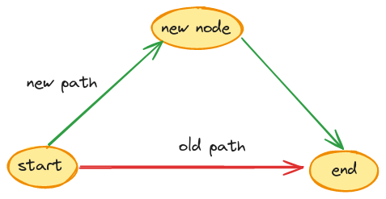
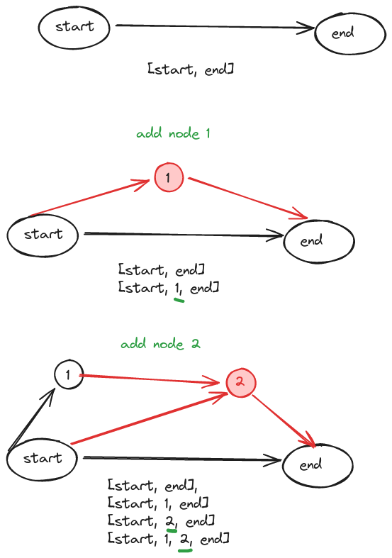
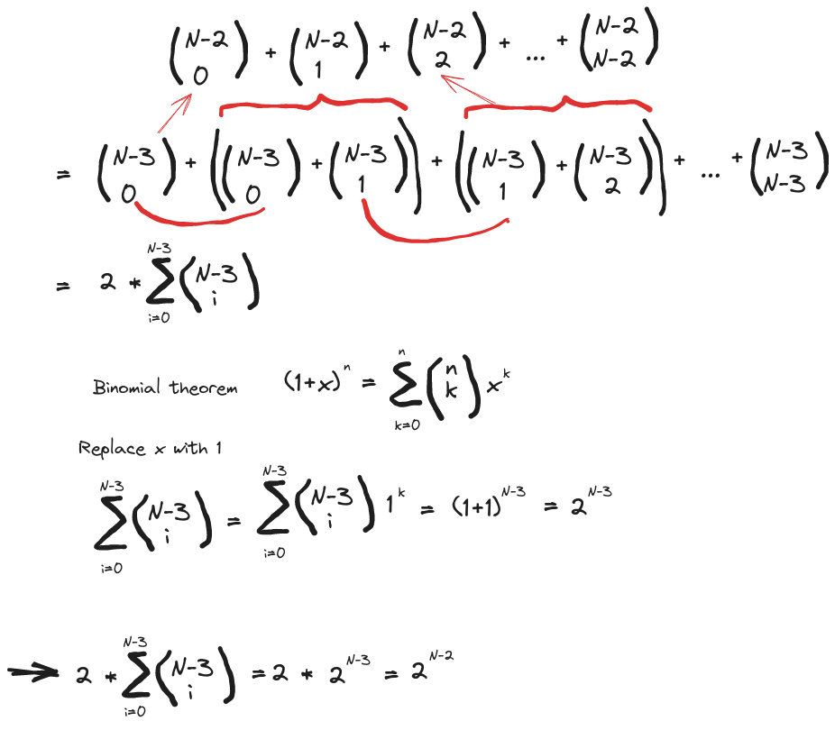
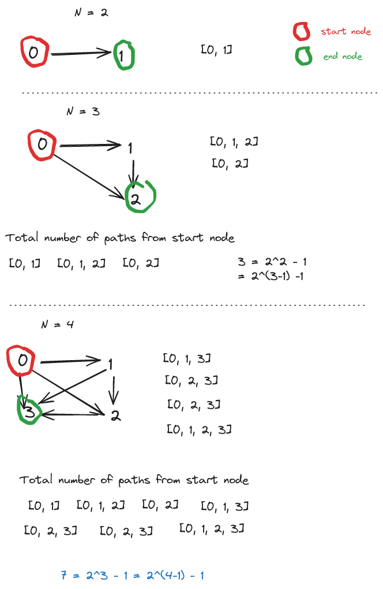

One of the most common problems in graph is finding all paths from a source vertex to a target vertex on a directed acyclic graph (DAG) using DFS approach.

This problem is available on the Graph section of [Leetcode](https://leetcode.com/problems/all-paths-from-source-to-target/editorial/). To calculate the time complexity of the solution, you need to know the maximum number of possible paths **between the starting and ending nodes**, because that would be the worst case.According to Leetcode, for a graph with N nodes, there are at maxmium 2^(N-1) -1 paths **between the starting and ending nodes**.

Why 2^(N-1) - 1, you may ask? This is where I got tripped up. It is also the number one question in the discussion section under this problem. And I found Leetcode's explanation for arriving at this number rather hasty and confusing, so I set out to find proof for this number.

## Maximum number of paths from start to end node

Let us start with a graph with only two nodes, i.e. no intermedite node. There is only one single path to connect the only two nodes in the graph.

If we add a new node into this graph, we noww have two paths, one from the previous path, the other one is bridged by the new node.

Notice that every time we add a new node:

- The previous paths are still valid. They still go from start to end nodes.
- We can create new paths by preceding all previous paths with the newly added node

So number of paths that go from the start node to the end node will double.

Here's a visual explanation.

The number doubling means that it must be an exponent (power) of 2. How do we figure out the base?

By intuition, we can see that

- With 0 intermediate node, maximum number of paths from start to end node is 1 = 2^0
- With 1 intermediate node, maximum number of paths from start to end node is 2 = 2^1

N nodes have (N - 2) intermediate nodes. So when there are N nodes, the maximum number of paths from start to end node is 2^(N-2).

### Proving by combinatorics

It is a given that every path from start to end nodes must contain these two nodes. They can include as many or as few intermediate nodes. So we only need to experiment with the remaining (N -2) nodes.

The number of possible paths are:

ways to choose 0 node from (N - 2) nodes + ways to choose 1 node from (N - 2) nodes + ... + ways to choose (N - 2) nodes from (N -2) node.

Translate this intuition into an expression:

C(N-2, 0) + C(N-2, 1) + C(N-2, 2) + ... + C(N-2, N-2)

There's a Pascal formula that states:

C(n - 1, k) + C(n - 1, k - 1) = C(n, k)

For example, C(N-2, 1) = C(N-3, 1) + C(N-3, 0).

The number on the far left and far right are exceptions. We can rewrite them as followed:

- C(N-2, 0) to to C(N-3, 0) because there is only one way to choose **0 node** from any number of nodes!
- C(N-2, N-2) to C(N-3, N-3) because there is only one way to choose n nodes from n given nodes.

Here is the full proof using Pascal formula and binomial theorem:

## Maximum number of paths from starting node

So we've got 2^(N-2) as the maximum number of paths from start to end nodes, but what if we don't need the paths to reach the target/end nodes? In other words, we want to know the number of possible paths from start node?

For N number of nodes, the number we need is the summation of:

- the number of paths that include start and end nodes when there are 0 intermediate node
- the number of paths that include start and end nodes when there are 1 intermediate node
- the number of paths that include start and end nodes when there are 2 intermediate node
- the number of paths that include start and end nodes when there are N - 2 intermediate node

Confused? Why do we have to sum? This is the most asked question in the discussion for this problem on Leetcode. At first, I can't wrap my head around it either. But everything gets clearer when you draw it out.

Every time we add a new node to the graph and make it the target node, previous paths will no longer qualify as **starting from source to target node**. To get the valid paths, we need to append the **new target node** to previous paths. These new paths are separate entities from the previous paths. They don't overlap.

However, since we don't care that paths end up at the target node, we can sum them.

In the diagram, you can see intuitively why the number is 2^(N-1) - 1.

### Proving with maths

There are many ways to prove 2^(N-1) - 1, but this solution by a poster on [Math Stackexchange](https://math.stackexchange.com/a/4367411/1277145) I find easiest to understand.

