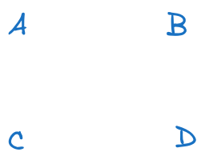
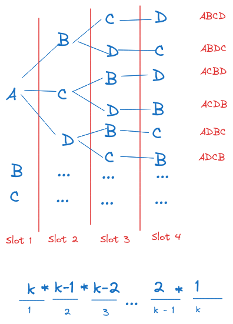

There is an interesting problem on Leetcode called Network Delay Time: Given a network of N nodes and a source node `k`, What is the minimum time for all the nodes to receive the signal from `k`?

The network in question is a directed, weighted graph. This graph can be a complete graph, which means each vertex is connected to every other vertex. This is the worst case because we will have to traverse all the paths of all possible lengths!

To figure the time complexity of this problem, the first thing to do is to know the total number of paths of all possible lengths.

Let's work at this question conceptually.

## Permutations and combinations

For simplicity's sake, assume the grap has only 4 nodes and path leng is fixed at 2.

Given a set of 4 nodes, how many ways to choose 2 nodes if we don't care about the order?

By eyes, we can see that there are 6 combinations of two nodes: [A, B], [A, C], [A, D], [B, C], [B, D], [C, D].

Within each group, there are 2 ways to arrange nodes:

- Group 1: AB, BA
- Group 2: AC, CA
- Group 3: AD, DA
- Group 4: BC, CB
- Group 5: BD, DB
- Group 6: CD, DC

What if k gets larger and it gets harder to track different arrangements?

Let's consider each node as taking a slot, so there is a total of `k` slots.

For the first slot, there are `k` ways to choose a node.

Fo each of the `k` scenarios, since a node has been taken away, only `k - 1` nodes remain. So there are `k - 1` ways to fill the second slot.

Total number of arrangements so far: k \* (k - 1).

The number of arrangements go down by 1 as we go to the next spot. For the final spot, there is only one node left, so only one way to fill it.

Here is a visual example. I didn't write out all the possible arrangements due to the lack of space, but hope you get the idea.

And what does k _ (k - 1) _ ... 1 remind us of? The factorial!

The number of ways of arranging `k` elements is k!.

In total, the number of unique arrangmenets of `k` objects from a set of `N` objects is:

C(N, k) \* k!

## Number of unique paths of all possible lengths

Since the original problem is about getting the total number of paths of any length, we can switch `k` for `len`, where `len` is the length of path.

The formula for getting number of paths of length `len` i:

C(N, len) \* len!

To get the total number of paths of all possible lengths, simply summ all of N choose len, where `len` ranges from 1 to N.

