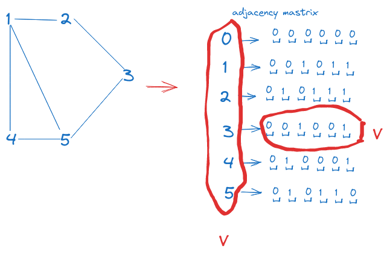
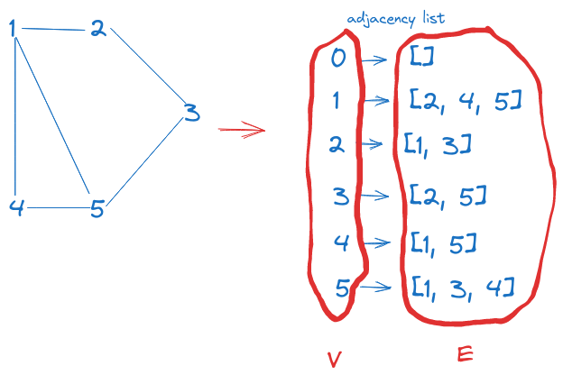

There are two ways to represent graph: using either adjacency matrix or adjacency list.

The space complexity for adjacency matrix is obvious. Let `V` be the number of nodes in the graph. An adjacency matrix is always a 2D matrix having dimension N x N.
The value of `adjMat[i][j]` denotes the connection between node `i` and node `j`:

- 0 means no connection
- 1 means there is an edge between i and j and the graph is unweighted
- some other numbers if there is a weighted edge

The array contains `V` elements, each of which is an array itself which also contains `V` elements. So the space complexity of adjacency matrix is `O(V^2)`.

However, by drawing out like this, you can see the limitation of adjacency matrix: No matter how many edges a graph has, it is always represented as a V x V matrix, and each slot is filled with a value. So adjacency matrix can be highly inefficient when the graph is sparse as we still have to use up V^2 units of memory.

On the other hand, an adjacency list is an array with `V` elements, but every i-th element is an array which only contains adjacent nodes to the i-th node.

Unlike adjacency matrix, the inner arrays in adjacency list can vary in size, depending on the number of edges branching out from the corresponding node. The total space consumed by these inner arrays add up to E, with `E` being the number of edges in a graph.

The adjacency list will require `V + E` units of memory, therefore `O(V + E)` space.

In the worst case where every vertex is connected to all the remaining vertices, the total number of edges is V(V - 1), so E will get closer to V^2 and space complexity of adjacency list will be similar to that of adjacency matrix.

However, notice that adjacency list contains only information about the edges. When we explore each node, we can tell easily how many adjacency nodes it has. So the space complexity for adjacency list is frequently represented as `O(V + E)`.
